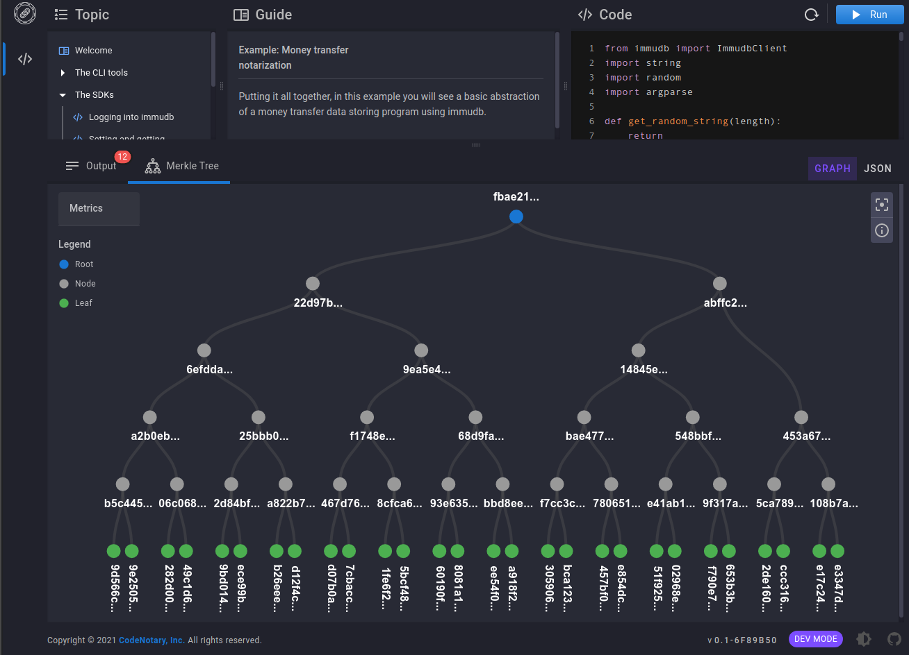

# immudb Client Examples

    

This Git repository is a central repository for examples using official immudb clients in different programming languages.

Examples (Python, Go, CLI) are tested against [immudb:latest](https://hub.docker.com/r/codenotary/immudb) container.

More documentation at:
- [Go](https://docs.immudb.io/master/) 
- [Java](https://github.com/codenotary/immudb4j)
- [Python](https://github.com/codenotary/immudb-py)
- [Node.js](https://github.com/codenotary/immudb-node)

We're actively working on the implementation of immudb clients for different languages.

The most complete client is implemented in Golang, and it's used to build immuclient and immuadmin CLIs.

immudb can easily be used from any language by means of [immugw].

[immugw]: https://immudb.io/docs/immugw/

# Playground

To learn interactively and get started with immudb from the command line and programming languages, visit the [immudb Playground](https://play.codenotary.com).

